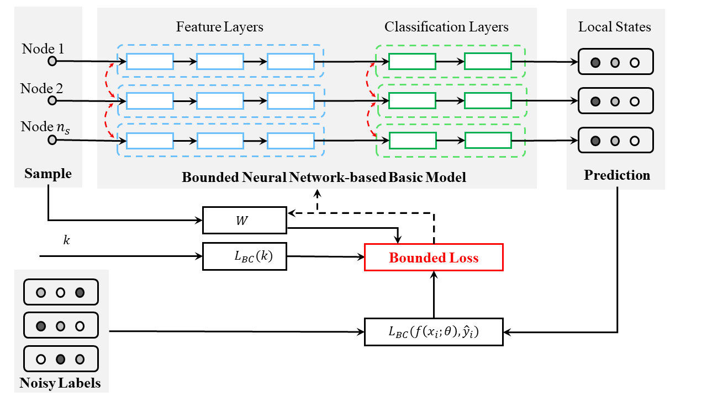

# Bounded Neural Network
The implementation of our paper in IEEE TIM 'A Unified Label Noise-Tolerant Framework of Deep Learning-based Fault Diagnosis via A Bounded Neural Network'.

**Highlights:** 
- Theoretical guarantee and enhancement of label noise tolerance for mechanical system fault diagnosis. 
- Applicable to different deep learning models.
- Implementation of multiple variants and SOTA methods.

|                 |
|:----------------------------------------:|
| Fig.1: The scheme of our proposed model. |


**A brief introduction**
	
Supervised fault diagnosis in mechanical systems, particularly in high-speed train components, 
faces significant challenges due to the presence of label noise in annotating large-scale monitoring data. 
This label noise introduces strict requirements for label-noise tolerance and the learning capabilities of fault diagnosis algorithms. 
We present a unified framework for label-noise fault diagnosis in high-speed train components using a bounded neural network (BNN) to address this issue. 
The proposed framework consists of multiple basic models with shared weights, enabling the learning of global knowledge 
across sensor nodes and facilitating the estimation of local states to adapt to dynamic measurement networks. 
The BNN-based basic model incorporates implicit weighted learning and bounded loss mechanisms, 
which extract valuable insights from mis-annotated data. 
Additionally, a tighter bound of loss is introduced, providing theoretical proof and enhancing the label-noise tolerance of the BNN.

FD performance in label-noise free scenario are reported as a table:

```
# FD performance with comparison to different variants
+------------+---------+---------+---------+------------+---------+
|   Models  | Accuracy | Precision |  Recall  | F1 Score |  Kappa  |
+------------+---------+---------+---------+------------+---------+
|  Deep CNN |  97.52%  |   97.23%  |   96.55% |  0.9689  |  0.9473 |
|  LSTM     |  97.79%  |   96.93%  |   95.40% |  0.9614  |  0.9530 |
|  GRU      |  97.62%  |   97.05%  |   94.56% |  0.9573  |  0.9498 |
|  BiLSTM   |  97.71%  |   97.31%  |   95.35% |  0.9628  |  0.9518 |
|  BiGRU    |  97.87%  |   97.53%  |   95.63% |  0.9654  |  0.9550 |

+------------+---------+---------+---------+------------+---------+
```

F1 scores of different FD models under different ratios of label noise are presented in a table. 
In the table, each column indicates F1 scores of different FD models under one specific ratio of label noise.
```
# F1 scores of different FD models under different ratios of label noise
+------------+---------+---------+---------+------------+---------++------------+---------+---------+---------+------------+---------++------------+---------+---------+----------+
| Models        | 0%              | 5%              | 10%             | 15%             | 20%             | 25%             | 30%             | 35%             | 40%             |
|---------------|-----------------|-----------------|-----------------|-----------------|-----------------|-----------------|-----------------|-----------------|-----------------|
| BiGRU - CEE   | 0.9693          | 0.9526          | 0.8983          | 0.8337          | 0.7635          | 0.6818          | 0.6208          | 0.5838          | 0.5073          |
| BiGRU - MAE   | 0.9364          | 0.9350          | 0.9301          | 0.8587          | 0.8532          | 0.8514          | 0.8067          | 0.7564          | 0.6552          |
| BiGRU - Mixup | 0.9872          | 0.9489          | 0.8975          | 0.8496          | 0.8031          | 0.7244          | 0.6648          | 0.5738          | 0.6183          |
| BiGRU - SCE   | 0.9521          | 0.9114          | 0.8708          | 0.8268          | 0.7996          | 0.7598          | 0.8138          | 0.7484          | 0.7383          |
| BNN           | 0.9501          | 0.9057          | 0.9105          | 0.9061          | 0.8928          |0.8766           | 0.8767          | 0.8376          | 0.8279          |
+------------+---------+---------+---------+------------+---------++------------+---------+---------+---------+------------+---------++------------+---------+---------+----------+
```

**Requirements**

I have tested on:

- Pytorch 2.1.0
- CUDA 12.1
- cuDNN 8801.

**Citation** 

To cite our work in your publications, please use the following bibtex entry:
```
@article{he2024unified,
  title={A Unified Framework of Data-driven Fault Diagnosis with Label Noises via A Bounded Neural Network},
  author={He, Sudao and Ao, Wai Kei and Ni, Yi-Qing},
  journal={IEEE Transactions on Instrumentation and Measurement},
  volume={},
  pages={},
  year={2024},
  publisher={IEEE}
}
```